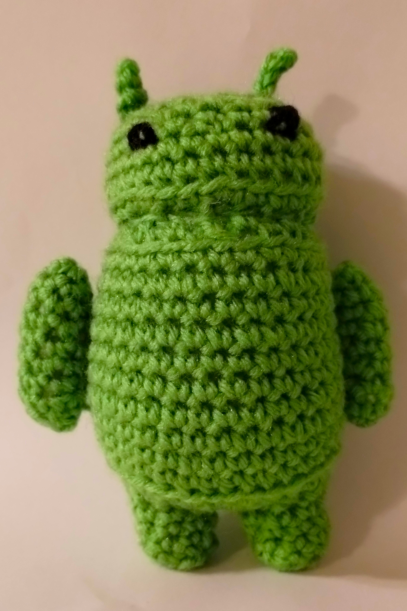

# Bugdroid - Amigurumi Crochet Pattern

<!--
SPDX-FileCopyrightText:  Google
SPDX-FileCopyrightText:  2023 Joseph Engelhardt <subvisser5@gmail.com>
SPDX-License-Identifier: CC-BY-4.0
-->

## Materials

- Yarn: Green, black
- Crochet hook
- Scissors

## Pattern

This pattern makes the little friend mostly in one piece, starting from the feet and moving up to the head. Arms, eyes, and antennae are the only separate pieces that require sewing. The shape is controlled by making certain stitches in just the front and back loops.

### Legs

Both legs follow the same pattern:

1: 8 sc in magic circle

2: sc blo around

3-5: sc around

Make the first leg and cut the yarn.

Make the second leg, then ch 2 and st into the first leg, joining the two round legs into a figure eight. You should count this as 16 stitches around: 8 stitches around each leg, minus 1 where the legs meet the chain (making 7*2=14), plus the chain from both sides (14+4=18).

Remember to stitch into the chain from both sides! It'll be tight, so offset an increase by one stitch if it would be too tight in the chain. This could mean making the increase early by one stitch, then making the second sc afterwards.

6: (2 sc flo, inc flo) x6 (24). 

7: (3 sc, inc) x6 (30)

Stuff the legs.

### Body

8: sc blo around (30)
9-18: sc around (30)

Stuff the body.

### Neck

This will create a valley that folds in then out again.

19: (3 sc blo, dec blo) x6 (24)

20: (2 sc blo, dec blo) x6 (18)

21: (2 sc flo, inc flo) x6 (24)

22: (3 sc flo, inc flo) x6 (30)

### Head

This will curve up into a dome.

23: sc blo around (30)

24: sc around (30)

25: (3 sc, dec) x6 (24)

26: (2 sc, dec) x6 (18)

Stuff the head.

27: (sc, dec) x6 (12)

28: 6 dec (6)

Stuff the head again, then sew closed.

Check along the folds by the legs and neck for a visible transition/seam. Position the following details so those transitions are on Bugdroid's back.

### Arms

Make two!

1: 4 sc into magic circle

2: 4 inc (8)

3-9: sc around (8)

Stuff.

10: 4 dec 

Sew closed, then sew to body.

### Antennae & Eyes

The antennae are made by slst into where you want them on the head, ch 2, then slst into second chain from hook and back into the head.

Eyes are placed where you want by sewing or button eyes or whatever.

## Licensing

This crochet pattern is adapted from the Android robot (often nicknamed "Bugdroid") character created and shared by Google and used according to terms described in the [Creative Commons 3.0 Attribution License](https://creativecommons.org/licenses/by/3.0/) per the [Android brand guidelines](https://developer.android.com/distribute/marketing-tools/brand-guidelines). This pattern is released under a [Creative Commons Attribution 4.0 International License](https://creativecommons.org/licenses/by/4.0/).
