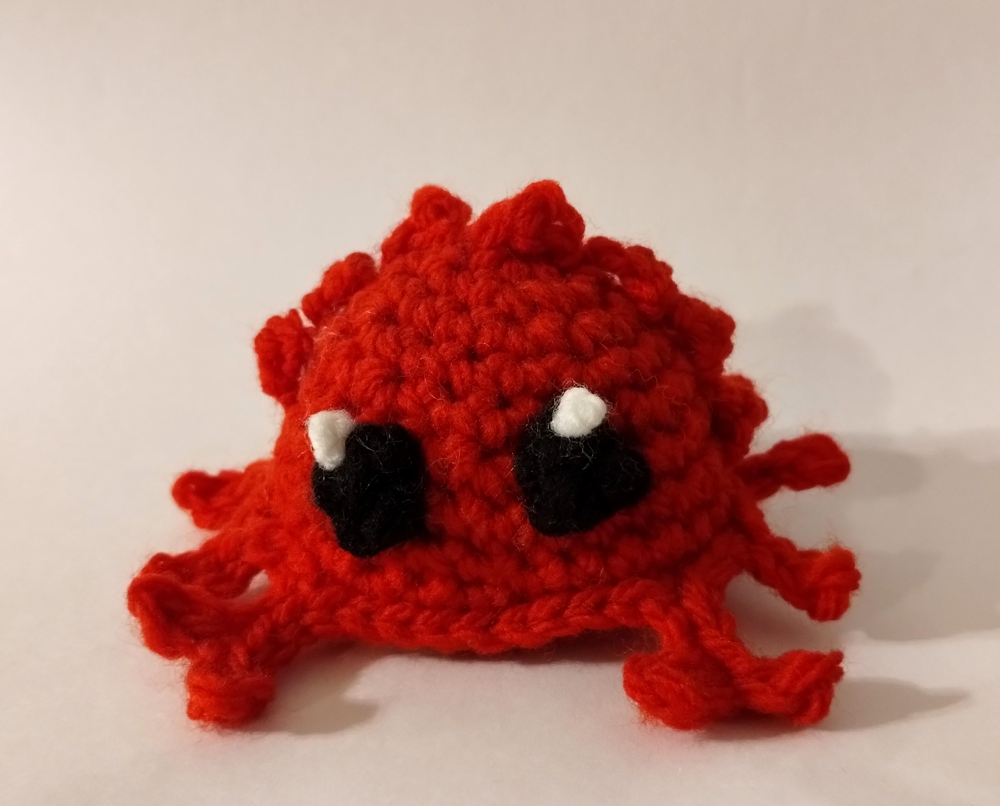
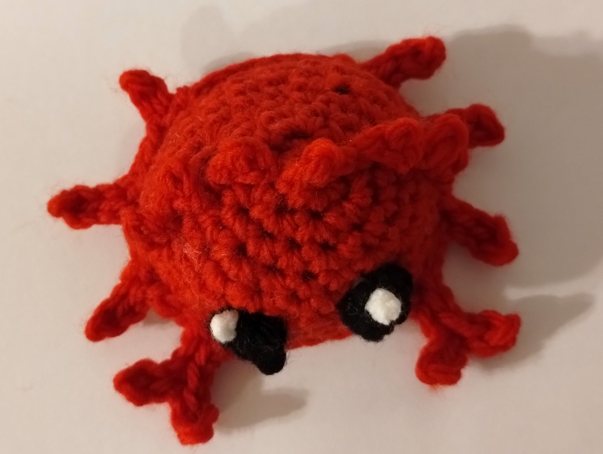

# Ferris the Rustacean - Crochet Pattern

<!--
SPDX-FileCopyrightText:  2022 Joseph Engelhardt <subvisser5@gmail.com>
SPDX-License-Identifier: CC-BY-4.0
-->

## Materials

- Yarn: rusty orange, black, white
- Hook of a proper size for your yarn

## Instructions

### Body

First, you will create a dome by starting with a magic circle then increasing gradually.

Round 1: 6 in magic circle (6)

2: inc around (12)

3: (2 sc, inc) x4, sc (16)

4: (3 sc, inc) x4, sc (20)

5: (4 sc, inc) x4, 2 sc (24)

6: (5 sc, inc) x4, 2 sc (28)

7: (6 sc, inc) x4, 3 sc (32)

8: (7 sc, inc) x4, 3 sc(36)

Second, you will create a flat base by stitching into the back loop then rapidly decreasing.

9: (2 sc, dec) in blo x9, st (27)

10: (1 sc, dec) x9 (18)

Stuff!

11: (1 sc, dec) x6 (12)

12: dec slst x6 (6)

Cut the yarn, pull through the remaining stitches, tighten, then tie off.

### Legs

Decapods have ten "legs," often eight walking legs and two claw/arm "legs." Coconut crabs have six walking legs and two arms (the remaining two are hidden in their shell). Ferris has two arms and either four or six walking legs, depending on the artist. You can choose either style here.

Start by hooking a slst into one of the open loops around the flat base, from round 9 of the body.

To make a walking leg: _Ch 4; slst into second stitch from hook, then slst 2 back down the chain and slst into the open loop next to where you started. slst 2._

To make a claw: _Ch 5; slst into second stitch from hook, then slst 1; ch 3; slst into second stitch from hook, then slst 4 back down and slst into the open loop next to where you started. slst 2._

Make the first set of legs.
* For six legs: follow the above instructions for legs three times.
* For four legs: slst 3, then make two legs.

Make the first claw, slst 6, then make the second claw. 

Make the second set of legs.
* If making six legs: do the same as before.
* If making four legs: make two legs following the instructions, then slst 3.

slst 6 to finish the round and tie off.

### Spines

Make 13: 

Ch 2, sc 1 2rd ch from the hook

Ch 1, cut the yarn and pull through

Sew into the dome; one for the center round, then one per row until you have six on either side and one in the center.

### Eyes

In black, ch 4, then sc into the second stitch from the hook and sc down to where you started. Tie off.

In white, tie a chunky little knot. Sew this into the black eye as a highlight.

## Licensing

This crochet pattern is adapted from the original [Ferris the Rustacean](https://rustacean.net) character design created by [Karen Rustad Tölva](https://aldeka.net/), released under a [CC0 1.0 Universal Public Domain Dedication](https://creativecommons.org/publicdomain/zero/1.0/), as an unofficial mascot for the [Rust programming language](https://www.rust-lang.org/). This pattern is licensed under a [Creative Commons Attribution 4.0 International License](https://creativecommons.org/licenses/by/4.0/).
