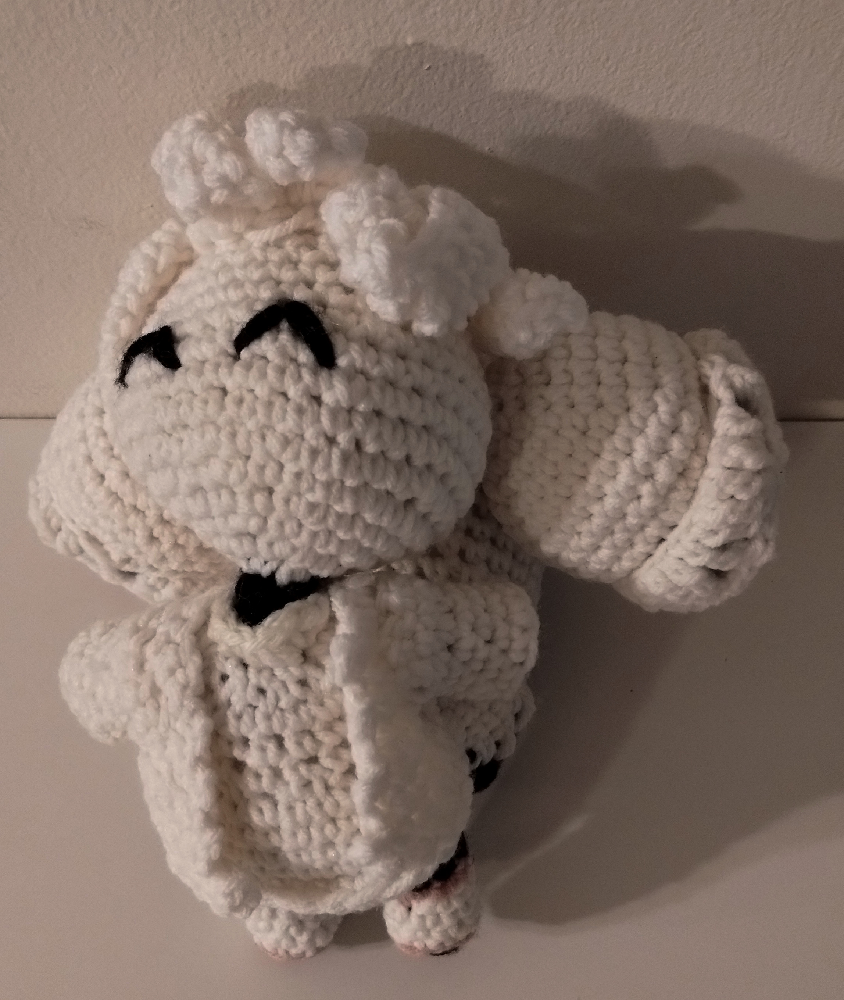
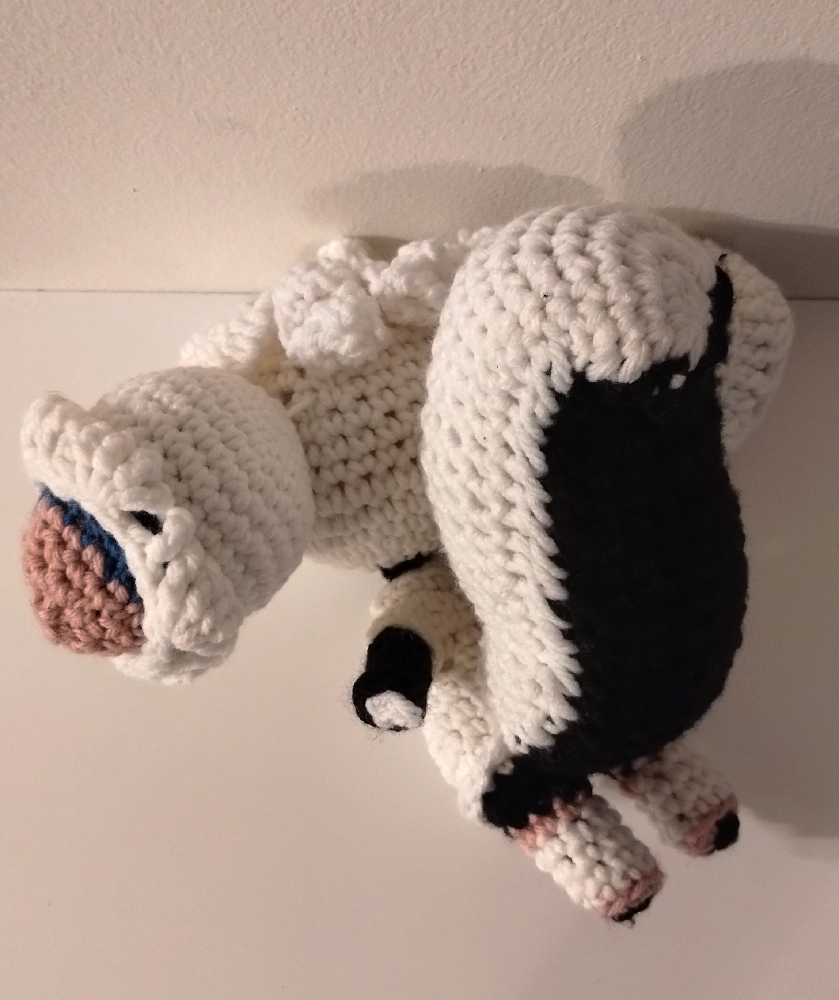
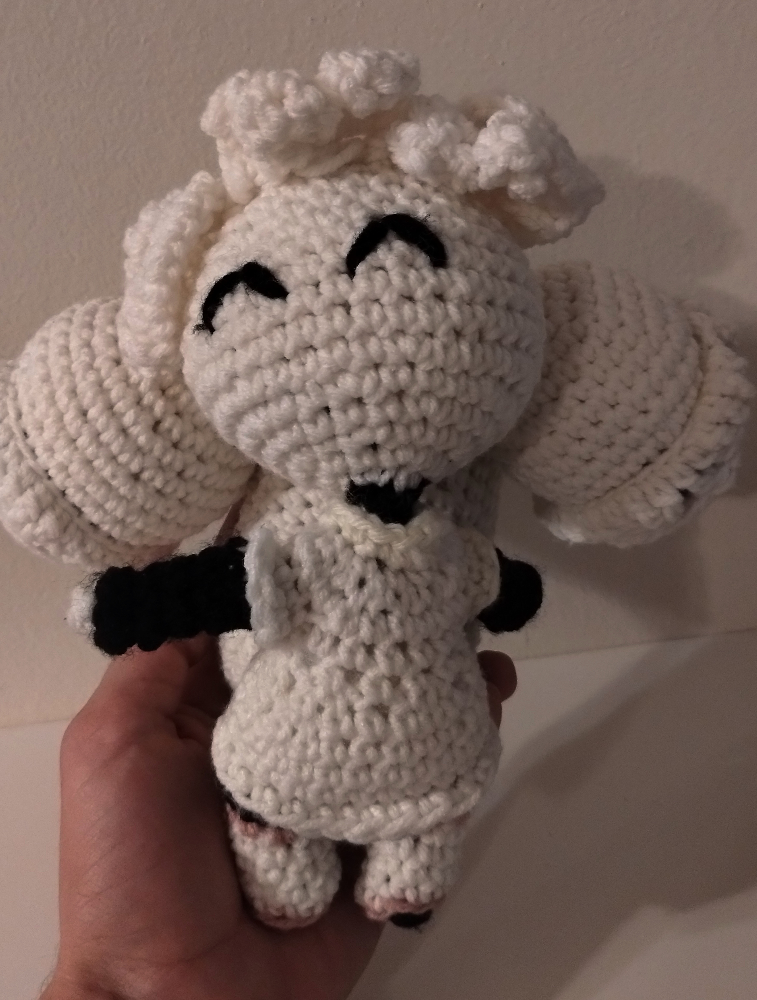
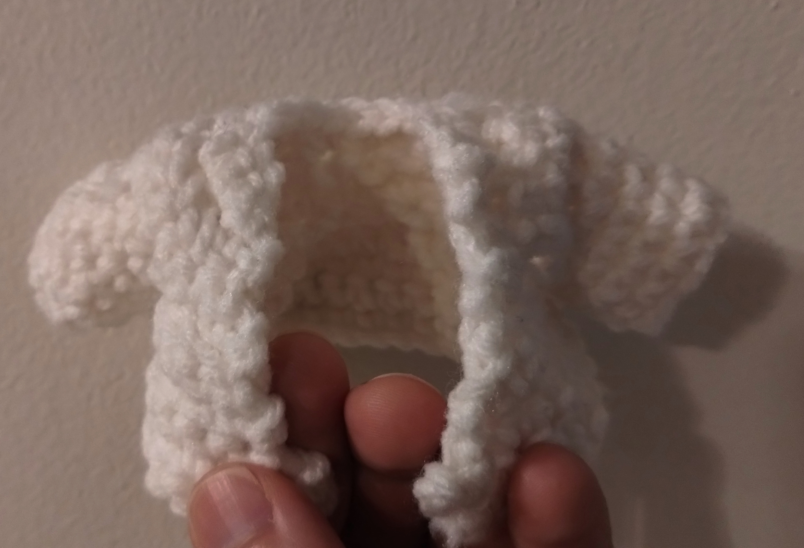

# Kiki the Cyber Squirrel

<!---
SPDX-FileCopyrightText: 2012 Tyson Tan
SPDX-FileCopyrightText: 2023 Joseph Engelhardt <subvisser5@gmail.com>
SPDX-License-Identifier: CC-BY-SA-4.0
--->

## Materials

- hook
- yarn: white, cyan, magenta, black/dark grey

## Instructions

This pattern makes her mostly in one piece, starting from the feet and moving up to the head. Eyes, tail, and fluffy ears are the only separate pieces that require sewing, and the jacket is removable.

### Switching Colors

When switching to a row of a new color, consider a variety of options for cleaner transitions. The simple technique I like is to make a slst in the old color before switching to the new color and continuing the written round.

### Legs

Both legs follow the same pattern:

> 1: In black, 4 sc into a magic circle (4)
>
> 2: In pink, inc around, then slst into the first stitch of this new color (8)
>
> 3: In white, blo sc around (8)
>
> 4--6: In white, sc around (8)
>
> 7: In pink, sc around
>
> 8: In black, sc around

Make the first leg and cut the yarn.

Make the second leg, then ch 2 and slst into the first leg, joining the two open rounds into a figure eight. You should count this as 16 stitches around: 8 stitches around each leg, minus 1 where the legs meet the chain (making 7*2=14), plus the 2 loops of the chain chain from both sides (14+4=18).

Remember to stitch into the chain from both sides! It'll be tight, so offset an increase by one stitch if it would be too tight in the chain. This could mean making the increase early by one stitch, then making the second sc afterwards.

### Torso

9: in black, [inc,  sc 2] x6 (24)

10: in white, sc around (24)

11: in white, blo sc around. After the torso is done (or later) come back and flo sc around. (24)

Depending on how you made your color transitions, row 12 might need to end a little late or early so later rows start along where the spine would be. <!---This is solvable by crocheting by row instead of in a spiral.--->

12: In white, sc around (24)

13: In white, [sc 6, dec] x3 (21)

14: In white, [sc 5, dec] x3 (18)

15: In white, [sc, dec] x6 (12)

Stuff loosely. Shoulders are next.

16: In white, [sc 3, ch 6, sc 3] x2 (24)

17: In white, [sc 3, sc 6 (into the ch), 3 sc] x2 (24).

Stuff some more. Rapidly decrease to the neck.

18: In white, dec x12 (12)

19: In black, dec blo x6 (6). After the head is complete, in white, sc flo around (12)

20: In black, sc around (6)

### Head

21: In white, inc around (12)

22: In white, [sc, inc] x6 (18)

23: In white, [2 sc, inc] x6 (24)

24: In white, [3 sc, inc] x6 (30)

25: In white, [4 sc, inc] x6 (36)

26--29: In white, sc around (36)

30: In white, [7 sc, dec] x4  (32)

31: In white, [6 sc, dec] x4 (28)

32: In white, [5 sc, dec] x4 (24)

Stuff.

31: In white, [4 sc, dec] x4 (20)

32: In white, [3 sc, dec] x4 (16)

33: In white, [2 sc, dec] x4 (12)

34: In white, dec around (6)

### Arms

Do for both arms:

In white, hook into the chain from the shoulders in round 16 of the torso. You'll have the 6 stitches of the chain and the 2 stitches where they initially joined the torso.

1: In white, sc around (8) 

2: In black, sc blo around. After the arm is done, come back and sc flo in white. (8)

3: In black, [sc 2, dec] x2 (6)

4--6: sc around (6)

7: in white, sc blo around. In black, sc flo around. (6)

Tie off the outer black row. Sew the inner white row closed.

### Puffy Hems: Skirt, Collar, and Sleeves

Hook into the open front loops from the torso and arms. Start with the "outside" facing you, stabbing toward the "inside" of the tube you're making.

In the matching color, sc around. End with a smooth stop of your choice, cut, and tie off.

### Ears

1: In white, 6sc into magic circle.

2: In white, 6 inc (12)

3: In white, [1 sc, inc, 1 sc] x4 16

4: In white, [3 sc, inc] x4 (20)

5: In white, [2 sc, inc, 2 sc] x4 (24)

6: In white, [5 sc, inc] x4 (28)

7: In white, [13 sc, inc] x2 (30)

8: In white, [7 sc, inc, 7 sc] x2 (32)

9--10: In white, sc around (32)

Keep the white yarn on the outside of the next row and do not cut.

11: In blue, in blo, [2 sc, dec] x8 (24)

13: In blue, [3 sc, dec, 3 sc] x3 (21)

14: In blue, [5 sc, dec] x3 (18)

15: In pink, [2 sc, dec, 2 sc] x3 (15)

16: In pink, [3 sc, dec] x3 (12)

17: In pink, [1 sc, dec, 1 sc] x3 (9)

Sew shut.

Return to the white, open loops from row 10. Hook into the open loop from the white side and pushing toward blue.

11: dec slst, slst around (31)

The petals/leaves of the ears/buns are tricky. Similar to a 5-stitch bobble stitch.

12: dec slst. in blo: ch 3, [ch 2, 5 tc leaving the last loop on the hook, pull a loop through all 6 loops, ch 2, tc] x5, skipping the last single tc and instead slst to the chain at the beginning (30)

13: Slst around (30)

Tie off. Make two, then sew on with white points positioned about 8--10 stitches apart on the 7th row from the top of the head.

### Hair

Hook into round 5 counting back from the top of the head, starting above where the outside corner of the left eye will be. Push your hook toward the top of the head so you will go around the head clockwise.

The pattern for each lock of hair is: ch n, turn, sc, dc, then tc the rest of the way down. Then Skip a stitch on the head and slst into the head.

1: Go around for with different chain lengths: 4x seven long, 2x twelve long, 1x ten, 1x eight, 1x ten, 2x twelve.

2: sc around the posts, ch, and repeat around.

3+: Dec around in a spiral until you get down to 6 stitches, then tie off.

### Face

Embroider her face on how you like!

### Tail

Do these in rounds instead of spirals. End each round with Slst to the first stitch, then ch 1. The first stitch of the next round should be in the same loop as the Slst.

1: In white, 6 sc in magic circle. (6)

2: In black, 1 inc. In white, 4 inc. In black, 1 inc. (12)

These vertical stripes will gradually twist, so we'll occasionally make some rows off by one to compensate.

3: In black, 3 sc. In white, 6 inc. In black, 3 sc. (18)

4--6: In black, 3 sc. In white, 12 sc. In black, 3 sc. (18)

7: In black, 2 sc, inc. In white, 3 sc, inc, 4 sc, inc, 3 sc. In black, 3 sc. (21)

8: In black, 4 sc. In white, 4 sc, inc, 4 sc, inc, 4 sc. In black, inc, 2 sc. (24)

9--25: In black, 4 sc. In white, 16 sc. In black, 4 sc. (24)

Stuff.

26: In black, 2 sc, dec. In white, 4 sc, dec, 4 sc, dec, 4 sc. In black, 4 sc. (21)

27: In black, 3 sc. In white, 3 sc, dec, 4 sc, dec, 3 sc. In black, 2 sc, dec. (18)

28: In black, sc, dec. In white, [sc, dec] x4. In black, dec, sc. (12)

Stuff again.

Cut the black, leaving a long tail, and pull through. Using a yarn needle, weave and sew through the black yarn through the tail in such a way to pull the tail into an s-curve. Then, sew the tail onto the body.

### Jacket (optional)

In white. Will be a separate, removable piece on the doll.

Torso: 24; 21; 18; 12 (8*3; 7*3; 6*3; 4*3)

Arms: 12 sc around and 6 sc long?

Body: 36 around and 12 sc tall?

### Jacket Body

1: Ch 31, flip, then sk 1 and 30 sc back (30)

2: Ch 1, flip, sc along (30)

3: Ch 1, flip, [8 sc, dec] x3 (27)

4: Ch 1, flip, [7 sc, dec] x3 (24)

5: Ch 1, flip, sc along (24)

Shoulders are next.

6: Ch 1, flip, [dec 3, ch 8, dec 3] x2 (28)

7: Ch 1, flip, [sc 3, sc 8 (into the ch), sc 3] x2 (28).

Rapidly decrease to the neck.

8: Ch 1, flip, dec x14 (14)

9: Ch 1, flip, sc along (14)

### Jacket Arms

Do for both arms:

In white, hook into the chain from the shoulders in round 6 of the body. You'll have the 8 stitches of the chain and the 2 stitches where they initially joined the torso.

1--6: In white, sc around (10)

Slst, then tie off.

### All done!

## Licensing

This crochet pattern is adapted from the Kiki character design by Tyson Tan, used under a [Creative Commons Attribution-ShareAlike 3.0 Unported license](https://creativecommons.org/licenses/by-sa/3.0/). This pattern is released under a [Creative Commons Attribution-ShareAlike 4.0 International license](https://creativecommons.org/licenses/by-sa/4.0/).

The [Kiki the Cyber Squirrel](https://krita.org/en/about/kiki/#) character was created by [Tyson Tan](https://tysontan.com/mascots/) as a mascot for [Krita](https://krita.org/en/). Tyson Tan provides mascot designs for free and open source software projects, free of charge, under free/libre licenses. The Kiki character design is dual-licensed under [GPL-2.0-or-later](https://www.gnu.org/licenses/old-licenses/gpl-2.0.html) and [CC-BY-SA-3.0](https://creativecommons.org/licenses/by-sa/3.0/) (see Tyson's [2012 KDE forum post](https://forum.kde.org/viewtopic.php?f=276&t=109395&p=256179)).
