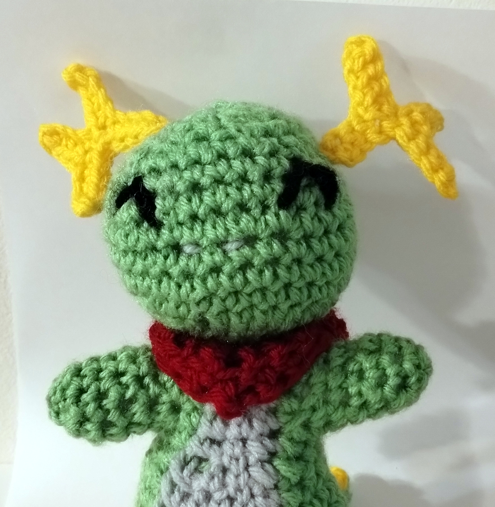
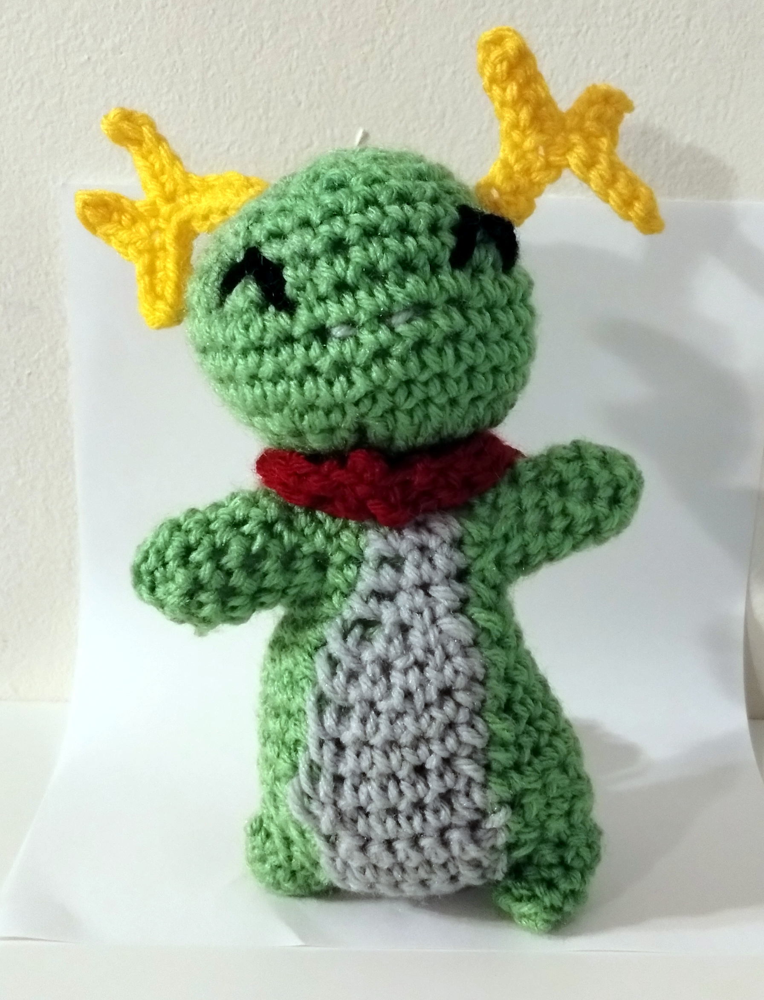
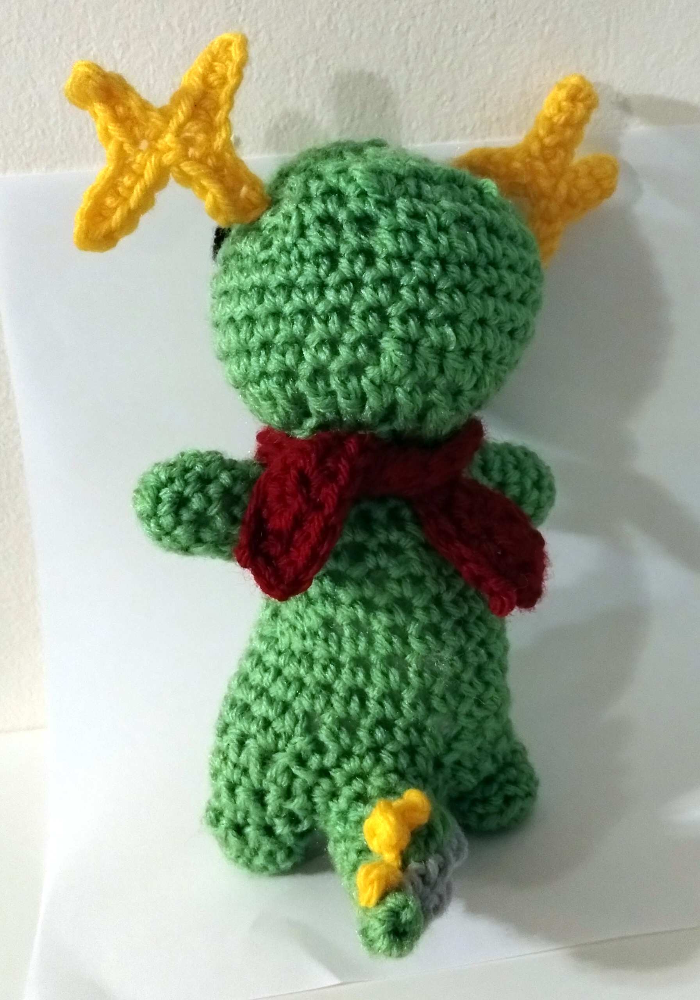

# Konqi the Dragon

<!--
SPDX-FileCopyrightText: 2012 Tyson Tan
SPDX-FileCopyrightText: 2023 Joseph Engelhardt <subvisser5@gmail.com>
SPDX-License-Identifier: CC-BY-SA-4.0
-->

## Materials

* Yarn: Pale green, bright green, yellow, red, black
* Crochet hook
* Stuffy fill
* Scissors
* Yarn needle

## Instructions

Start working from the bottom of the feet, up to the top of the head.

### Legs

Make two in bright green.

> 1: 4 sc in magic ring (4)
>
> 2: inc x4 (8)
>
> 3: In blo, sc around (8)
>
> 4: sc around (8)
>
> Slst and tie off.

### Tail

Here, you'll switch between bright green and pale green to make a pale underbelly.

1: In bright, 4 sc in magic ring (4)

2: sc around (4)

3: In pale, 1 sc. In bright, 3 sc. (4)

4: In pale, inc. In bright, 1 sc, inc, 1 sc. (6)

5: in pale, 2 sc. In bright, inc, 2 sc, inc. (8)

6: In pale, 2 sc. In bright, 6 sc. (8)

7: In pale, inc, sc. In bright, 2 sc, inc, 3 sc. (10)

8--10: In pale, 3 sc. In bright, 7 sc. (10)

11: In pale, inc, 2 sc. In bright, inc, 2 sc, inc, 2 sc. (12)

Stuff!

Don't tie off.

### Joining legs & tail together to form the hips

Continuing from the tail. This transition is quite tricky.

1: In bright green, slst to the left leg. Turn. In pale, 6 sc. In bright, slst to the other leg. Turn. In pale, 6 sc.

Make sure the feet end up facing down, toward the pale green!

First, we'll create a clean starting point for future rounds. In bright green, 7 sc around the leg, and slst to the tail.

2--3: Turn. In bright, 7 sc around the leg. In pale, 6 sc. In bright, 7 sc around the leg, and slst to the tail.

You should now be back at your starting point again.

4: Turn. In bright, 7 sc around the leg. In pale, 6 sc. In bright, 7 sc around then leg, then 4 sc along the top of the tail.
1 sc for round numbers. (24)

Consider putting small weights like coins or hex nuts into the bottom of the feet to weigh them down.

Stuff the legs and tail.

It should now feel like a single round again instead of three parts!

### Body

You'll continue to switch between bright green and pale green to make a pale underbelly as you work up the torso.

5--8: In bright, 6 sc. In pale, 6 sc. In bright, 12 sc. (24)

9: In bright, 2 sc, dec, 2 sc. In pale, 2 sc, dec, 2 sc. In bright, 2 sc, dec, 8 sc. (21)

10: In bright, dec, 3 sc. In pale, 1 sc, dec, 2 sc. In bright, 3 sc, dec, 6 sc. (18)

11: In bright, dec, 2 sc. In pale, 1 sc, dec, 1 sc. In bright, 2 sc, dec, 2 sc, dec. (12)

Stuff loosely. Shoulders are made next.

12: In bright, 1 sc, ch 6, 2 sc. In pale, 3 sc. In bright, 2 sc, ch 6, 4 sc. (24)

13: In bright, 1 sc, 6 sc into the ch, 2 sc. In pale, 3 sc. In bright, 2 sc, 6 sc into the chain, 4 sc. (24).

Stuff some more. Rapidly decrease to form the neck.

14: In bright, dec x12 (12)

15: In bright, [2 sc, dec] x3 (9)

### Head

The head is shaped like an egg turned on its side.

16: In bright, hdc increase around (18)

17: In bright, [dc inc, dc] x2, dc inc, [hdc. hdc inc] x2, dc inc, dc, [hdc inc, hdc] x3 dc (27)

18: In bright, 15 sc to point, 3 sc in one stitch, 12 sc (30)

19--20: In bright, sc around (30)

The next little increase puffs up the nose.

21: In bright, 14 sc, inc x2, 14 sc (32)

Decrease to form the top of the head.

22: In bright, 4 sc, [3 sc, dec] x2, 4 sc, [3 sc, dec] x2, 4 sc (28)

23: In bright, 4 sc, [dec, 2 sc] x2, 4 sc, [dec, 2 sc] x2, 4 sc (24)

Stuff!

24: In bright, 4 sc, [sc, dec] x2, 4 sc, [sc, dec] x2, 4 sc (18)

25: In bright, 2 sc, 3 dec, 2 sc, 3 dec, 2 sc (12)

Stuff some more!

26: In bright, 6 dec (6)

Tie off.

Embroider facial features as you like.

### Arms

Do this for both arms.

> In bright green, hook into the open chain from round 12 of the body. You'll have the 6 stitches of the chain and the 2 stitches where they initially joined the torso.
>
> 1: In bright, sc x8 around the arm hole (8)
>
> 2--4: In bright, sc around
>
> 5: In bright, [2 sc, dec] x2. (6)
>
> Tie off and sew closed.

### Spines

In yellow. Make three.

> ch 3, hdc in 3rd chain from hook
>
> Cut and tie off, with a long tail for sewing.

Sew to his tail!

### Antlers

In yellow. Make two.

> 1: ch 8
>
> 2: ch 1, turn; sc 4; ch 5, turn, sc 3, ch 5, turn, sc 5 back; sc 4
>
> Cut and tie off, leaving a long tail for sewing.

Sew to his head!

### Kerchief/Bandana

In red.

1: Chain 37.

2: ch 1 turn; 6 sc, 6 slst, 6 sc, hdc, 6 sc, 6 slst, 6 sc (37)

3: ch 1, turn; 2 sc, hdc, dc, hdc, sc, 6 slst, sc, 2 hdc, 3 dc, tc, 3 dc, 2 hdc, sc, 6 slst, sc, hdc, dc, hdc, 2 sc

4: ch 1, turn; 3 sc, hdc, 2 sc, 6 slst, 4 sc, hdc, dc, tc, dc, hdc, 4 sc, 6 slst, 2 sc, hdc, 3 sc

Cut and tie off.

Tie around his neck.

## Licensing

This crochet pattern is based on the Konqi character design by Tyson Tan used under CC-BY-SA-4.0. This pattern is released under [Creative Commons Attribution Sharealike 4.0]().

[Konqi](https://community.kde.org/Konqi) was created by [Tyson Tan](https://tysontan.com/mascots/) as a mascot for [KDE](https://kde.org/). Tyson Tan provides mascot designs for free and open source software projects, free of charge, under free/libre licenses. The Konqi character design is licensed under LGPL-2.0-or-later, and CC-BY-SA-4.0, and GFDL.
